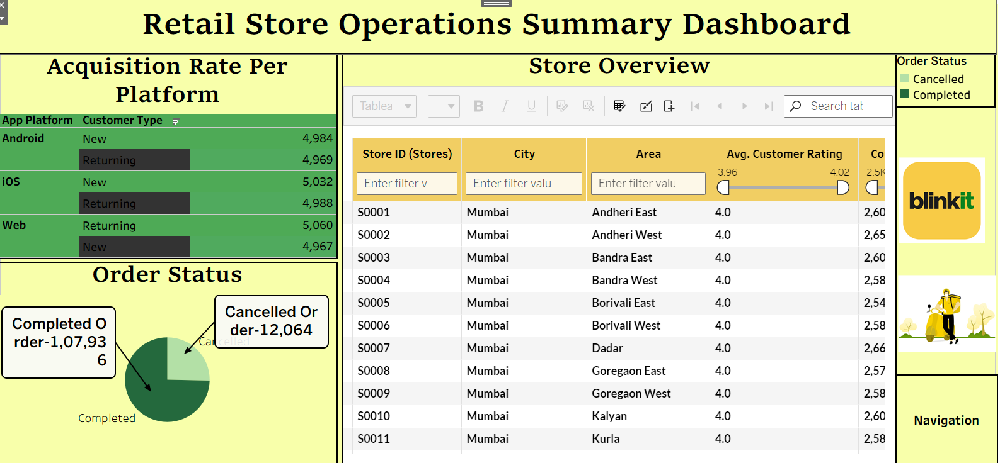
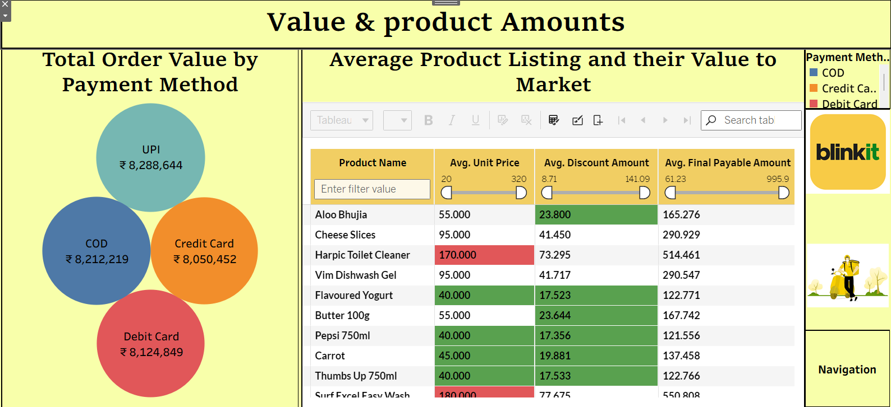
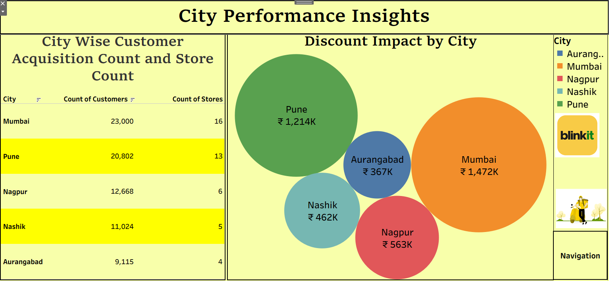
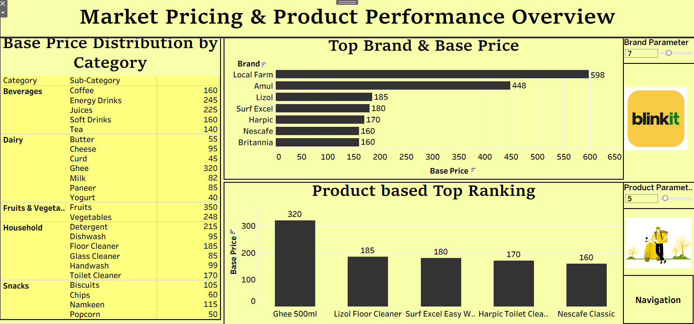
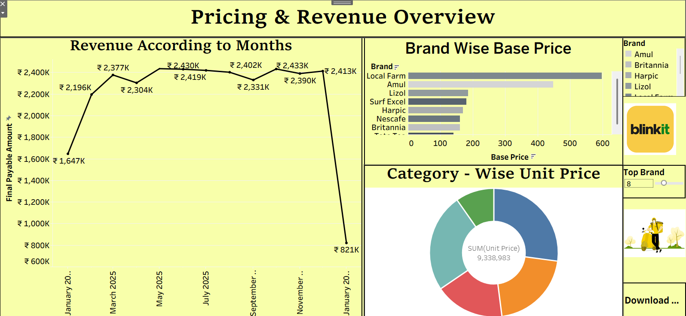

# Blinkit Retail Performance Analytics Dashboard 📊

## 📌 Project Overview

This project showcases an **end-to-end Retail Performance & Pricing Analytics Dashboard** inspired by **Blinkit-style quick commerce**, built using **Tableau**.

The dashboard analyzes retail transactions across multiple cities to understand:

* Pricing behavior
* Store and city performance
* Customer acquisition and retention
* Discount effectiveness
* Payment method impact
* Revenue trends

The goal of this project is to demonstrate how **data-driven insights** can improve pricing strategy, operational efficiency, and business decision-making in quick-commerce platforms.

---

## 📊 Dataset Summary

* **100,000+** retail transactions
* **5 major cities**
* **20+ product categories**
* **50+ brands**
* Multiple payment methods

📌 *Note:*
This dataset represents **online quick-commerce orders** (Blinkit-style), not offline retail sales.

---

## 🏙️ Cities Covered

* Mumbai
* Pune
* Nagpur
* Nashik
* Aurangabad

---

## 🧾 Key Data Attributes

* Order value & final payable amount
* Base price & discount amount
* Product category & brand hierarchy
* Store and city details
* Customer type (New / Returning)
* Payment method & order status
* Monthly transaction timeline

---

## 🛠️ Tools & Technologies Used

* **Tableau Desktop** – Dashboard creation & visualization
* **Tableau Prep / Excel** – Data cleaning and transformation
* **Calculated Fields** – KPIs, ratios, pricing, and performance metrics

---

## 📈 Dashboard Overview

The project includes **multiple interactive dashboards**, each focused on a different business area.
For GitHub presentation, the **main dashboards** are highlighted below.

---

## 🖼️ Dashboard Previews

### 🔹 Store Operations Dashboard

This dashboard monitors customer acquisition across platforms, order completion vs cancellation, and store-level performance. It helps evaluate operational efficiency, platform effectiveness, and overall store health.

### 🔹 Value & Product Amounts

This dashboard analyzes total order value by payment method and compares product pricing, discounts, and final payable amounts. It helps understand payment preferences and how product pricing and discounts affect revenue.

### 🔹 City Performance Insights

This dashboard compares customer acquisition, store count, and discount impact across cities. It helps identify top-performing cities, customer reach, and how discounts influence sales at the city level.

### 🔹 Market Research Dashboard

This dashboard analyzes product pricing across categories, brands, and top products to identify premium items, pricing differences, and market positioning. It helps understand how pricing varies at category, brand, and product levels for better pricing decisions.

### 🔹 Pricing & Revenue Overview

This dashboard tracks monthly revenue trends and compares base prices across brands and categories. It helps identify revenue stability, premium brands, and category-wise pricing contribution to overall revenue.

---

## 📄 Full Dashboard File

👉 **[View Complete Tableau Project](Blinkit.twbx)**

This PDF contains all dashboard views with filters and interactive insights.

---

## 🔍 Key Insights

### 📌 Pricing & Revenue Insights

* Monthly revenue stays stable between **₹2.2M – ₹2.45M**, showing seasonal patterns
* Premium brands contribute significantly to total revenue
* Category-level pricing has a stronger impact than heavy discounting

---

### 👤 Customer Behavior Insights

* **Returning customers** generate equal or higher order volume than new customers
* Web and iOS platforms show stronger repeat usage
* Indicates strong customer loyalty in quick-commerce

---

### 🏙️ City-Level Performance

* **Mumbai and Pune** lead in revenue and order volume
* Smaller cities show **better discount efficiency per customer**
* Promotional impact varies by city, suggesting targeted strategies

---

### 💳 Payment Method Analysis

* **UPI** generates the highest completed order value
* **COD** shows a slightly higher cancellation rate
* Digital payments are strongly linked with successful order completion

---

### 🧾 Product & Discount Analysis

* Moderate pricing with controlled discounts performs better than heavy discounting
* High discounts do not always increase revenue
* Product mix and category selection are key revenue drivers

---

## 🧠 Key Takeaways

* Revenue growth in quick-commerce depends more on **pricing strategy and repeat customers** than discounts
* City and category-level insights are more valuable than overall totals
* Payment behavior directly affects revenue realization
* Clear dashboards and KPIs improve business decision-making

